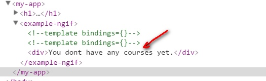
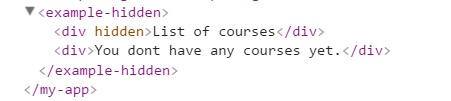
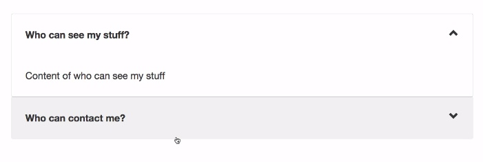
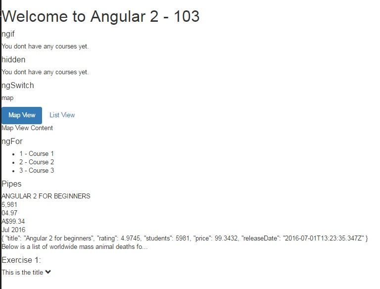

# Angular2-103
In this section you will learn of how to Control the Rendering of the HTML.  It's important to well understand the rendering
so you can build a slick font-end application. Most of the samples are from the course [Angular 2 with TypeScript](https://www.udemy.com/angular-2-tutorial-for-beginners/learn/v4/overview) by Mosh Hamedi on Udemy.
I'm developping the Angular 2 samples along way I'm learning Angular 2. If you have time, I recommend you to take the course because it has richer contents.

- [Jumpstart](https://github.com/dacho68/Angular2-Jumpstart) - Quick understanding of how to build an App with Angular 2.
- [101](https://github.com/dacho68/Angular2-101) - Property Binding, Class and Style Binding, Event Binding, Two way Binding.
- [102](https://github.com/dacho68/Angular2-102) - Component API in depth, Input and Output properties.
- 103 - Controlling Rendering of the HTML - ngId, ngSwitch, ngFor, Leading *, Pipes, ngClass, ngStyle, Elvis Operator, ng-content. 
- [104](https://github.com/dacho68/Angular2-104) - Forms and Validations.
- [Connectivity](https://github.com/dacho68/Angular2-Connectivity) - Connecting to the server.

## ngIf vs [Hiden]
ngIf will not generate the element if it's condition is *false*; You archive the same result by binding to the DOM *hidden* attribute on an element.

**Syntax**
``` html
    - <div *ngIf="condition">...</div>
    - <div template="ngIf condition">...</div>
    - <template [ngIf]="condition"><div>...</div></template>
```

**Example:** using *ngIf
``` typescript
@Component({
    selector: 'example-ngif', 
    template: `
          <div *ngIf="courses.length > 0">List of courses</div>
          <div *ngIf="courses.length == 0">You dont have any courses yet.</div>
          
          `,
   directives:[],
})

```
The false condition element is not exist the DOM as showing below.<br>


**Example:** using *hidden*
``` typescript
@Component({
    selector: 'example-hidden', 
    template: `
          <div [hidden]="courses.length == 0">List of courses</div>
          <div [hidden]="courses.length > 0">You dont have any courses yet.</div>
          `,
   directives:[],
})
```
The element is hidden but it's still in the DOM.  Therefore Angular is still checked for change even it's hidden <br>




## ngSwitch
It allows to switch between elements

**Example: ** ngSwitch
``` typescript
    @Component({
        selector: 'example-ngswitch', 
        template: 
        `     <p>{{viewMode}}</p>
            <ul class ="nav nav-pills">
                <li [class.active]="viewMode =='map'"> <a (click)="viewMode = 'map'">Map View</a></li>
                <li [class.active]="viewMode =='list'"><a (click)="viewMode = 'list'">List View</a></li>            
            </ul>
            <div [ngSwitch]="viewMode">
                <template [ngSwitchWhen] = "'map'" ngSwitchDefault> Map View Content </template>
                <template [ngSwitchWhen] = "'list'"> List View Content </template>
            </div>
    `,
    directives:[],
    })

    export class ExampleNgSwitchComponent {
    viewMode = 'map';
    }
```
## ngFor

**Syntax :**

``` html
    - <li *ngFor="let item of items; #i = index">...</li>
    - <li template="ngFor #item of items; #i = index">...</li>
    - <template ngFor #item [ngForOf]="items" #i="index"><li>...</li></template>
```
Note: # to indicate a local variable and the first index of an array is 0 (base 0)

**Example: ** ngFor
``` typescript
    @Component({
        selector: 'example-ngfor', 
        template: `
                <ul>
                <li *ngFor="#course of courses, #i = index">
                    {{i+1}} - {{course}}
                </li>
                </ul>         
            `,
    directives:[],
    })

    export class ExampleNgForComponent {
    courses = ['Course 1', 'Course 2', 'Course 3'];
    }
```
## Leading asterisk (*)

The asterisk is the Angular syntax sugar that add the _template_ element automatically for us. here are the equivalent the above example that uses the ngFor 
without the '*'

``` typescript
              <ul>
                <template ngFor [ngForOf]="courses" #course #i=index>
                <li> {{i+1}} - {{course}} </li>
                </template>
              </ul>  
```

## Pipes (|)
Pipes is used for format data, such as
    - Uppercase
    - Lowercase
    - Decimal
    - Currency
    - Date
    - Json
    
## Exercise 1 - Make an Accordion (Zippy) Component
Make a voter component as you see below.



Interface

``` html5
    <zippy title = "This is the title">
        Here is the content
    </zippy>     
    
Icon :

glyphicon-chevron-down
glyphicon-chevron-up 

[ngClass]
```

[Solution](https://github.com/dacho68/Angular2-103/blob/master/app/exercises/zippy.component.ts)

## Output

